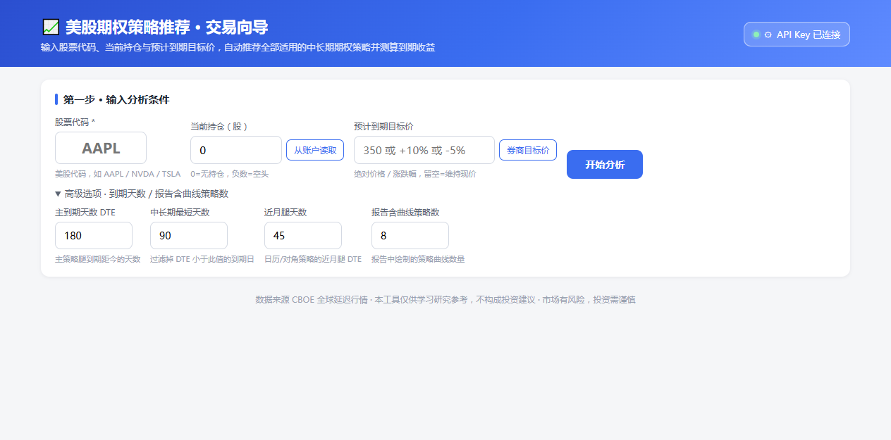
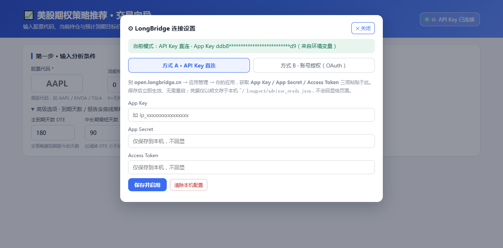
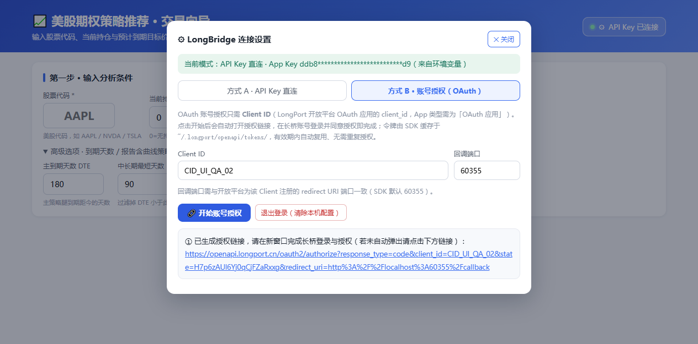

# 美股期权策略推荐器 · US Options Advisor

> 输入「股票代码 + 持仓」→ 自动从 CBOE 延迟行情拉链 + 从 LongPort(长桥)读取账户真实持仓与机构一致预期 → 推荐中长期期权策略并按到期股价测算收益。

仅供学习研究参考,**不构成投资建议**。





---

## ✨ 核心特性

- 📊 **真实行情数据**:直接拉 CBOE 官方延迟行情接口(免费、稳定),含期权链、隐含波动率、希腊字母
- 🧠 **中长期策略全覆盖**:LEAPS、价差、备兑、现金担保卖沽(CSP)、领口、铁鹰、铁蝶等,看涨/看跌/波动中性/与持仓联动四象限分类
- 💰 **自动接入账户**:接 LongPort(长桥)OpenAPI → 一键带入该股真实持仓、美元现金、券商一致目标价、财报日历
- 🤖 **AI 白话解读**:确定性规则引擎把"持仓 × 目标价 × 财报窗口 × 资金占用 × 策略收益"交叉成听得懂的人话,而不是甩希腊字母表
- 🖥️ **双端可用**:命令行版(`options_advisor.py`)直接出控制台+HTML 报告;Web 版(`web_server.py`)浏览器内点一点即可
- 🔐 **零手动配置**:页面右上角「连接设置」弹窗 —— API Key 直连 / OAuth 账号授权 二选一,无需改环境变量、无需重启服务

---

## 📂 项目结构

```
us-options-advisor/
├── options_advisor.py        # 核心:策略引擎 + CBOE 行情 + 报告生成
├── longbridge_api.py         # LongPort(长桥)OpenAPI 集成 + OAuth 子进程状态机
├── web_server.py             # 本地 HTTP 服务 (ThreadingHTTPServer, 零外部依赖)
├── web/
│   ├── index.html            # 单页前端 (内联样式 + JS + ECharts)
│   └── echarts.min.js        # ECharts 5 本地副本,无需联网
├── reports/                  # 示例截图与输出
└── .gitignore
```

代码体量:`options_advisor.py` ~1010 行 · `web_server.py` ~750 行 · `longbridge_api.py` ~600 行 · `web/index.html` ~990 行。**仅 Python 标准库 + ECharts + `longport` SDK 三个外部依赖**。

---

## 🚀 快速开始

### 环境要求
- **Python 3.10+**(使用了 PEP 604 `Optional[X] | None` 联合类型语法)
- Windows / macOS / Linux 均可,代码不依赖平台特定 API

### 安装
```bash
git clone https://github.com/weiyuan0917-a11y/us-options-advisor.git us-options-advisor
cd us-options-advisor

# 推荐在虚拟环境中安装
python -m venv .venv
.venv\Scripts\activate          # Windows
# source .venv/bin/activate     # macOS / Linux

pip install longport            # 仅第三方依赖
```

### 命令行版(无 Web)
```bash
# 交互模式:逐步提问
python options_advisor.py

# 一行参数跑完
python options_advisor.py --ticker AAPL --position 0 --target-price +10%
python options_advisor.py --ticker NVDA --position 200 --target-price 200 --dte 270
```

会输出:控制台策略表 + 同名 `.html` 报告(收益曲线图、希腊字母、到期情景表),默认保存到 `reports/`。

### Web 版(推荐)
```bash
python web_server.py --port 8123
# 浏览器打开 http://127.0.0.1:8123/
```

---

## 🖥️ Web UI 用法

打开 `http://127.0.0.1:8123/` 后:

1. **输入区**:填股票代码 → (可选)填持仓股数 → (可选)填目标价 → 点「分析」
2. **结果区**:「单策略」/「多策略对比」两个 Tab,各自带收益曲线表、到期 ROI、希腊字母、最大风险
4. **右侧 LongBridge 区**(可选):
   - 「从账户读取」→ 拉取该股真实持仓与美元现金
   - 「读取一致预期」→ 拉取券商一致目标价与下次财报日期
   - 自动触发页面上的「AI 策略解读」交叉验证
5. **右上角「连接设置」按钮**(⚙ 图标):
   - **方式 A · API Key 直连**:填 App Key / App Secret / Access Token → 保存即生效
   - **方式 B · OAuth 账号授权**:填 Client ID + 回调端口 → 点「开始账号授权」→ 浏览器自动弹出官方授权页 → 登录长桥账号同意 → 完成
   - 「退出登录」一键清除本机凭据与 SDK 缓存令牌

> 凭据优先级:**本地配置文件 > 环境变量**。环境变量名:`LONGPORT_APP_KEY` / `LONGPORT_APP_SECRET` / `LONGPORT_ACCESS_TOKEN` / `LONGPORT_CLIENT_ID`。

---

## 📡 HTTP API

| 方法 | 路径 | 说明 |
|---|---|---|
| GET | `/api/analyze?ticker=...&position=0&dte=180&min_dte=90&near_dte=45` | 主分析:返回策略表 + insight + 持仓/一致预期 |
| GET | `/api/lp/positions?ticker=...` | LongPort:该股账户持仓 + 美元现金 |
| GET | `/api/lp/analyst?ticker=...` | LongPort:券商一致目标价 + 财报日期 |
| GET | `/api/lp/config` | 当前凭据状态(脱敏) |
| GET | `/api/lp/oauth/status` | OAuth 授权子进程状态机 |
| POST | `/api/lp/config` | `{action:"save_apikey"\|"save_oauth"\|"clear", ...}` |
| GET | `/api/iv?ticker=...` | 仅取 IV 历史 |
| GET | `/api/report?ticker=...` | 单策略 HTML 报告(浏览器直接打开) |
| GET | `/api/csv?ticker=...` | 策略 CSV 导出 |

所有响应均为 JSON(报告/CSV 端点除外,返回 `text/html` / `text/csv`)。

---

## ⚙️ 命令行参数

```text
options_advisor.py [-h] [--ticker TICKER] [--position POSITION]
                   [--target-price TARGET] [--dte DTE]
                   [--min-dte MIN_DTE] [--near-dte NEAR_DTE]
                   [--chart-top N] [--data-file FILE] [--out OUT]
```

| 参数 | 默认 | 说明 |
|---|---|---|
| `--ticker` | 交互 | 股票代码,如 `AAPL` |
| `--position` | 0 | 当前持仓股数(可为 0 或负) |
| `--target-price` | 现价 | 绝对价 `350` 或涨跌幅 `+10%`/`-5%` |
| `--dte` | 180 | 主到期日目标天数 |
| `--min-dte` | 90 | 中长期最短过滤 |
| `--near-dte` | 45 | 日历/对角策略近月腿天数 |
| `--chart-top` | 6 | HTML 报告中画收益曲线的策略数 |
| `--data-file` | - | 调试:本地 CBOE JSON 缓存 |
| `--out` | - | HTML 报告输出路径 |

---

## 🧱 架构

```
浏览器(index.html + ECharts)
        │  fetch /api/*
        ▼
ThreadingHTTPServer(web_server.py)
   ├── /api/analyze ──► options_advisor.build_strategies + make_insight
   ├── /api/lp/*   ──► longbridge_api (LongPort SDK, 凭据优先级: 文件 > 环境变量)
   │                   OAuth 子进程 ──► 状态文件 ──► 父进程轮询 (避免 GIL 冻结服务)
   └── /api/report, /api/csv ──► HTML/CSV 模板
        │
        ▼
   CBOE 延迟行情 (urllib, 无需 key)
```

### 关键设计

- **零外部 Web 依赖**:服务端仅用 `http.server` + `urllib`;前端 ECharts 走本地 `web/echarts.min.js`
- **OAuth 子进程隔离**:`OAuthBuilder(...).build()` 在等浏览器授权期间会持有 GIL 锁死解释器 → 拆到独立子进程跑 + 状态文件(`~/.longport/oauth_state.json`)同步,主服务一直可响应
- **凭据安全清除**:Windows 下自写文件常被杀软句柄锁,导致 `os.remove` 自己刚写的文件失败 → 改为"原子覆写为空 `{}` + 尽力删除",清除语义不依赖物理删除
- **前端去重**:OAuth URL 弹窗的去重保护,避免每次轮询都开新标签页

---

## ⚠️ 已知问题与注意事项

- 📡 **本沙箱环境无法访问 Yahoo / yfinance**:网络层被限流 → 本工具改用 CBOE 延迟行情,无需 key 即稳定
- 🌐 **本沙箱无法访问 `openapi.longport.cn`**:OAuth URL 是 SDK 本地构造故仍能拿到,账户/持仓/一致预期读取会在沙箱报 `Connect`;**在你的正常网络环境即返回真实数据**
- 💵 **期权杠杆高、风险大**:任何策略建议务必先在模拟盘验证;本工具仅供学习研究,不构成投资建议
- 🪟 **跨平台提示**:Windows 上读写用户目录走 `%USERPROFILE%` 等价 `~`;Linux/macOS 同理

---

## 🛠️ 开发

```bash
# 本地直接运行(已配置好 python 路径即可)
python web_server.py --port 8123

# 验证 LongBridge 配置链路(假 client_id 也可,只看状态机)
curl http://127.0.0.1:8123/api/lp/config
curl http://127.0.0.1:8123/api/lp/oauth/status

# 触发一次分析
curl "http://127.0.0.1:8123/api/analyze?ticker=AAPL&position=0&dte=180&min_dte=90&near_dte=45" | head
```

代码遵循单一职责:
- 算法/数学 → `options_advisor.py`(纯函数,无 IO 副作用)
- 券商集成 → `longbridge_api.py`(所有副作用收敛于此)
- HTTP/前端 → `web_server.py` + `web/index.html`

---

## 📜 License

MIT(见 `LICENSE`)。代码仅供学习研究,**不构成投资建议**。

---

## 🙋 常见问题

**Q: 必须配 LongPort 才能用吗?**
A: 不配也能用,只是无法自动带入持仓/一致预期,所有参数都要手填。

**Q: 不想给 LongPort 凭据怎么办?**
A: 不点「连接设置」即可,工具完全本地运行,不会向长桥发送任何请求(除非你主动点那两个读取按钮)。

**Q: 我已有别的券商账户,能换数据源吗?**
A: `longbridge_api.py` 是单一收敛点,按其函数签名替换为其他券商 SDK 即可(`effective_creds / oauth_begin / fetch_positions / fetch_analyst` 等)。

**Q: 推荐器给出的策略我可以直接下单吗?**
A: 请务必人工复核。本工具仅输出策略建议与到期测算,不会自动下单,也不应被理解为投资建议。